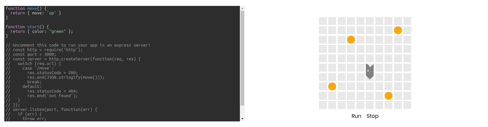

# Try

A simple battlesnake trial app. Allows me to type code into a browser and have it run a single snake.

## Available Scripts

In the project directory, you can run:

### `npm start`

Runs the app in the development mode. 
Open [http://localhost:3000](http://localhost:3000) to view it in the browser.

The page will reload if you make edits. 
You will also see any lint errors in the console.

### `npm test`

Launches the test runner in the interactive watch mode. 
See the section about [running tests](https://facebook.github.io/create-react-app/docs/running-tests) for more information.

### `npm run build`

Builds the app for production to the `build` folder. 
It correctly bundles React in production mode and optimizes the build for the best performance.

The build is minified and the filenames include the hashes. 
Your app is ready to be deployed!

See the section about [deployment](https://facebook.github.io/create-react-app/docs/deployment) for more information.

### `npm run deploy`

This will copy files to a google cloud bucket repository you must be signed in to run this.

## Learn More

You can learn more in the [Create React App documentation](https://facebook.github.io/create-react-app/docs/getting-started).

To learn React, check out the [React documentation](https://reactjs.org/).

### Feedback

* **Do you have an issue or suggestions for this repository?** Head over to our [Feedback Repository](https://play.battlesnake.com/feedback) today and let us know!
